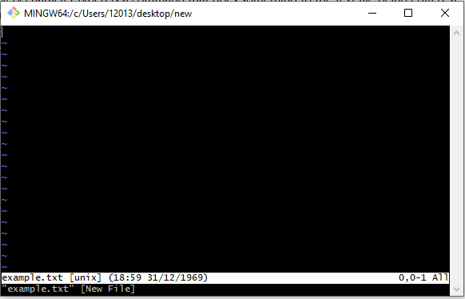
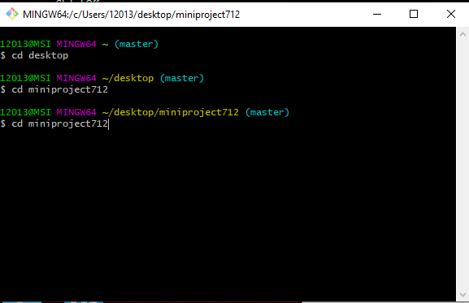
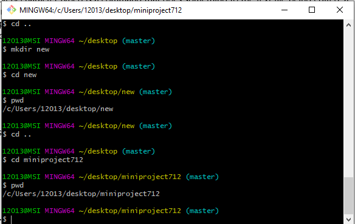
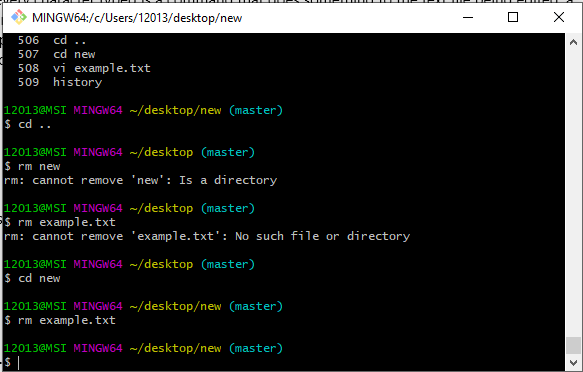
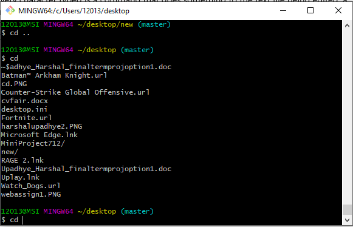


* **
  * **VI**

In the command mode, every character typed is a command that does something to the text file being edited; a character typed in the command mode may even cause the vi editor to enter the insert mode. In the insert mode, every character typed is added to the text in the file; pressing the <Esc> (Escape) key turns off the Insert mode and press :wq to come out of vi mode

**example**

vi example.txt



* **CD**

cd command is known as change directory command. It is used to change current working directory.

**example**

cd desktop





* **MKDIR**

mkdir command in Linux allows the user to create directories (also referred to as folders in some operating systems ). This command can create multiple directories at once as well as set the permissions for the directories. It is important to note that the user executing this command must have enough permissions to create a directory in the parent directory, or he/she may recieve a ‘permission denied’ error.

**example**

mkdir  [directories ...]




* **CP**

cp stands for copy. This command is used to copy files or group of files or directory. It creates an exact image of a file on a disk with different file name. cp command require at least two filenames in its arguments. 

**example**

cp [OPTION] Source Destination

cp [OPTION] Source Directory

cp [OPTION] Source-1 Source-2 Source-3 Source-n Directory

* **PWD**

pwd stands for Print Working Directory. It prints the path of the working directory, starting from the root.

**example**

pwd




* **mv**

mv stands for move. mv is used to move one or more files or directories from one place to another in file system like UNIX.
No additional space is consumed on a disk during renaming. This command normally works silently means no prompt for confirmation.

**example**

mv source destination

* **RM**

rm stands for remove here. rm command is used to remove objects such as files, directories, symbolic links and so on from the file system like UNIX. To be more precise, rm removes references to objects from the filesystem, where those objects might have had multiple references (for example, a file with two different names). By default, it does not remove directories.

**example**

rm  File





 * **HISTORY**

history command is used to view the previously executed command. This feature in which every command executed is treated as the event and is associated with an event number using which they can be recalled and changed if required

**example**

history 





* **HOME DIRECTORY AND ~**

A home directory, also called a login directory, is the directory on Unix-like operating systems that serves as the repository for a user's personal files, directories and programs. It is also the directory that a user is first in after logging into the system. 

**example**

cd ~

* **FILE PATH IN LINUX**

A path is a unique location to a file or a folder in a file system of an OS.A path to a file is a combination of / and alpha-numeric characters.


*  **USING THE TAB KEY TO COMPLETE THE PATH**

In Linux command line if we press tab after getting inside a particular file folder by the help of "cd" command
the by pressing "tab" we can see the list of folders those exist in there.

**example**

cd desktop[press TAB]





* **USING UP AND DOWN ARROW KEYS FOR HISTORY**

when we write a command in command prompt it actually keeps the track of commands that we provide to it
and whenever we want to repeat previously given commands again then instead of writing them again those up and down arrow keys can be used to re-write them.

* **How Python uses Indentation to control Flow**
One of the distinctive features of Python is its use of indentation to highlight the blocks of code. Whitespace is used for indentation in Python. All statements with the same distance to the right belong to the same block of code. If a block has to be more deeply nested, it is simply indented further to the right







































