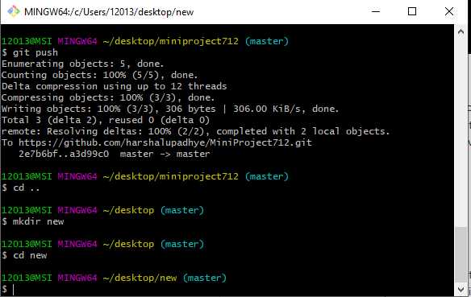
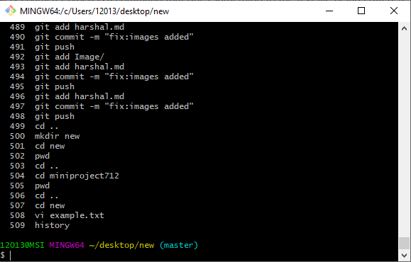


* **
  * **VI**

In the command mode, every character typed is a command that does something to the text file being edited; a character typed in the command mode may even cause the vi editor to enter the insert mode. In the insert mode, every character typed is added to the text in the file; pressing the <Esc> (Escape) key turns off the Insert mode and press :wq to come out of vi mode

**example**

vi example.txt



* **CD**

cd command is known as change directory command. It is used to change current working directory.

**example**

cd desktop





* **MKDIR**

mkdir command in Linux allows the user to create directories (also referred to as folders in some operating systems ). This command can create multiple directories at once as well as set the permissions for the directories. It is important to note that the user executing this command must have enough permissions to create a directory in the parent directory, or he/she may recieve a ‘permission denied’ error.

**example**

mkdir  [directories ...]




* **CP**

cp stands for copy. This command is used to copy files or group of files or directory. It creates an exact image of a file on a disk with different file name. cp command require at least two filenames in its arguments. 

**example**

cp [OPTION] Source Destination

cp [OPTION] Source Directory

cp [OPTION] Source-1 Source-2 Source-3 Source-n Directory

* **PWD**

pwd stands for Print Working Directory. It prints the path of the working directory, starting from the root.

**example**

pwd




* **mv**

mv stands for move. mv is used to move one or more files or directories from one place to another in file system like UNIX.
No additional space is consumed on a disk during renaming. This command normally works silently means no prompt for confirmation.

**example**

mv source destination

* **RM**

rm stands for remove here. rm command is used to remove objects such as files, directories, symbolic links and so on from the file system like UNIX. To be more precise, rm removes references to objects from the filesystem, where those objects might have had multiple references (for example, a file with two different names). By default, it does not remove directories.

**example**

rm  File





 * **HISTORY**

history command is used to view the previously executed command. This feature in which every command executed is treated as the event and is associated with an event number using which they can be recalled and changed if required

**example**

history 





* **HOME DIRECTORY AND ~**

A home directory, also called a login directory, is the directory on Unix-like operating systems that serves as the repository for a user's personal files, directories and programs. It is also the directory that a user is first in after logging into the system. 

**example**

cd ~

* **FILE PATH IN LINUX**

A path is a unique location to a file or a folder in a file system of an OS.A path to a file is a combination of / and alpha-numeric characters.


*  **USING THE TAB KEY TO COMPLETE THE PATH**

In Linux command line if we press tab after getting inside a particular file folder by the help of "cd" command
the by pressing "tab" we can see the list of folders those exist in there.

**example**

cd desktop[press TAB]





* **USING UP AND DOWN ARROW KEYS FOR HISTORY**

when we write a command in command prompt it actually keeps the track of commands that we provide to it
and whenever we want to repeat previously given commands again then instead of writing them again those up and down arrow keys can be used to re-write them.

* **How Python uses Indentation to control Flow**

One of the distinctive features of Python is its use of indentation to highlight the blocks of code. Whitespace is used for indentation in Python. All statements with the same distance to the right belong to the same block of code. If a block has to be more deeply nested, it is simply indented further to the right

* **Don't Repeat Yourself**

using same type of loops and statements again and again is repeating. We have been told to use different types of loops and statement.

* **CSV Files**

A CSV is a comma-separated values file, which allows data to be saved in a tabular format. CSVs look like a garden-variety spreadsheet but with a .csv extension. CSV files can be used with most any spreadsheet program, such as Microsoft Excel or Google Spreadsheets.

* **Extended Class**

You can extend a class to provide more specialized behavior. A class that extends another class inherits all the methods and properties of the extended class. In addition, the extending class can override the existing virtual methods by using the override keyword in the method definition.

* **Decorator**

Decorators are very powerful and useful tool in Python since it allows programmers to modify the behavior of function or class. Decorators allow us to wrap another function in order to extend the behavior of wrapped function, without permanently modifying it.


* **Factory**

Factory method is a creational design pattern which solves the problem of creating product objects without specifying their concrete classes. 


* **constructor**

A constructor is a special kind of method that Python calls when it instantiates an object using the definitions found in your class. Python relies on the constructor to perform tasks such as initializing (assigning values to) any instance variables that the object will need when it starts.

* **Unit Test**

nit Testing is the first level of software testing where the smallest testable parts of a software are tested. This is used to validate that each unit of the software performs as designed.


* **Exception**
exceptions can be handled using a try statement. A critical operation which can raise exception is placed inside the try clause and the code that handles exception is written in except clause. But if any exception occurs, it is caught by the except block.


* **Methods**

a method is a function that is available for a given object because of the object's type. For example, if you create my_list = [1, 2, 3] , the append method can be applied to my_list because it's a Python list: my_list.append(4) . All lists have an append method simply because they are lists.

* **Property/ Attribute**
An instance attribute is a Python variable belonging to one, and only one, object. ... A class attribute is a Python variable that belongs to a class rather than a particular object. It is shared between all the objects of this class and it is defined outside the constructor function,
the main purpose of Property() function is to create property of a class. Return: Returns a property attribute from the given getter, setter and deleter


* **Static**

Static means, that the member is on a class level rather on the instance level. Static variables exist only in single instance per class and are not instantiated. If a static variable is changed in one instance of the class, the change will affect its value in all other instances.

* **Object**

Object is simply a collection of data (variables) and methods (functions) that act on those data. And, class is a blueprint for the object.

* **Class**
A class is a code template for creating objects. Objects have member variables and have behaviour associated with them. 


* **Design Patterns from Gang of Four**

Design patterns provide solutions to common software design problems. In the case of object-oriented programming, design patterns are generally aimed at solving the problems of object generation and interaction, rather than the larger scale problems of overall software architecture. They give generalised solutions in the form of templates that may be applied to real-world problems.

Design patterns are a powerful tool for software developers. However, they should not be seen as prescriptive specifications for software
































